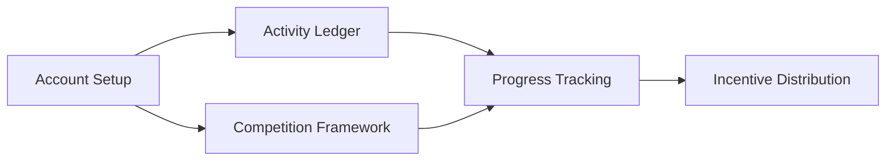

# Fitness Progress Ledger

An on-chain fitness tracking system built on Stacks for verifiable activity recording and competitive participation with incentive mechanisms.

## Purpose

Fitness Progress Ledger provides an immutable, transparent platform for recording physical activities and managing group athletic competitions. By storing fitness data on the blockchain, participants benefit from cryptographic verification and automated reward distribution.

## Key Capabilities

- **Tamper-proof activity records** - All workouts are permanently recorded with blockchain verification
- **Competitive frameworks** - Create and manage athletic competitions with clear participation rules
- **Transparent incentives** - Track progress and automatically validate achievement targets
- **Community engagement** - Participants join competitions with verifiable results
- **Historical accountability** - Access complete activity history for any user account

## System Architecture

The Fitness Progress Ledger operates through a unified smart contract managing three interconnected domains:



### Core Subsystems

1. **Account Management** - Registration, profile metadata, activity aggregation
2. **Activity Recording** - Individual session logging with categorization and metrics
3. **Competition System** - Framework for creating competitions and tracking participation

## Contract Reference

### workout-ledger.clar

Primary contract delivering all fitness ledger functionality.

#### Mutation Functions

**`setup-account`**
```clarity
(define-public (setup-account (user-identifier (string-utf8 50)))
```
Initialize a new account with display identifier. Called once per participant.

**`submit-activity`**
```clarity
(define-public (submit-activity 
  (activity-type (string-utf8 20)) 
  (time-minutes uint) 
  (energy-burned uint) 
  (optional-notes (optional (string-utf8 200))))
```
Record a new activity session with associated metrics.

**`launch-competition`**
```clarity
(define-public (launch-competition 
  (competition-title (string-utf8 100)) 
  (competition-description (string-utf8 500))
  (start-block uint)
  (end-block uint)
  (activity-target uint)
  (min-duration uint)
  (award-amount uint))
```
Create competition with defined parameters and reward structure.

**`enroll-in-competition`**
```clarity
(define-public (enroll-in-competition (comp-id uint))
```
Register as participant in an active competition.

#### Query Functions

**`query-account-info`**
```clarity
(define-read-only (query-account-info (principal-id principal))
```
Retrieve user account details and statistics.

**`fetch-activity-by-id`**
```clarity
(define-read-only (fetch-activity-by-id (activity-id uint) (principal-id principal))
```
Access specific activity record.

**`fetch-competition-info`**
```clarity
(define-read-only (fetch-competition-info (comp-id uint))
```
View competition structure and rules.

**`check-competition-enrollment`**
```clarity
(define-read-only (check-competition-enrollment (comp-id uint) (principal-id principal))
```
Verify participation status in competition.

## Quick Start

### Setup Requirements

- Clarinet 2.0+
- Stacks wallet configuration

### Installation

1. Clone repository
2. Install Clarinet dependencies
3. Configure deployment network

### Usage Examples

```clarity
;; Setup participant account
(contract-call? .workout-ledger setup-account "alice_trainer")

;; Log activity session
(contract-call? .workout-ledger submit-activity "running" u45 u325 none)

;; Create competition
(contract-call? .workout-ledger launch-competition 
    "Q1 Fitness Challenge" 
    "Complete 20 activities in 90 days" 
    u1000 u1500 u20 u25 u10000)

;; Join competition
(contract-call? .workout-ledger enroll-in-competition u1)

;; Check account progress
(contract-call? .workout-ledger query-account-info tx-sender)
```

## Advanced Topics

### Testing & Validation

Execute test suite:
```bash
clarinet test
```

Monitor contract execution:
```bash
clarinet console
```

### Activity Categories

The system supports the following activity classifications:
- Running
- Walking
- Cycling
- Swimming
- Weightlifting
- Yoga
- HIIT
- Pilates

Additional categories can be registered through contract administration.

### Competition Parameters

- **Start Block** - Block height when competition becomes active
- **End Block** - Block height when competition concludes
- **Activity Target** - Number of activities required for completion
- **Minimum Duration** - Minimum session length in minutes
- **Award Amount** - Reward distributed to successful participants

## Safety Considerations

### Design Constraints

- Account initialization is one-time per principal
- Activities must exceed 0 minutes
- Competition dates must be chronologically valid
- Enrollment requires active competition window

### Operational Guidelines

1. Verify competition parameters before enrollment
2. Validate activity data accuracy during submission
3. Monitor competition timelines for reward qualification
4. Confirm transaction finality for critical operations

### Data Validation Rules

- Activity types are pre-defined and validated
- Duration and energy metrics must be positive integers
- Competition windows must follow logical progression
- User identifiers are UTF-8 strings up to 50 characters

## Integration & Development

### Local Environment

```bash
# Start local development environment
clarinet console

# Deploy contracts
clarinet deploy

# Run full test suite
clarinet test
```

### Network Configuration

Configuration files available for:
- Devnet (local testing)
- Testnet (public testing)
- Mainnet (production deployment)

## Performance Notes

- Activity records are indexed by sequence ID
- Competitions are identified by unique counter
- Account lookups are O(1) by principal
- Competition queries include all metadata

## Roadmap & Future Enhancements

- Multi-user leaderboards
- Social network integration
- Advanced reward mechanisms
- Mobile wallet compatibility
- Integration with external fitness APIs

---

**Version:** 1.0.0  
**License:** MIT  
**Network:** Stacks
